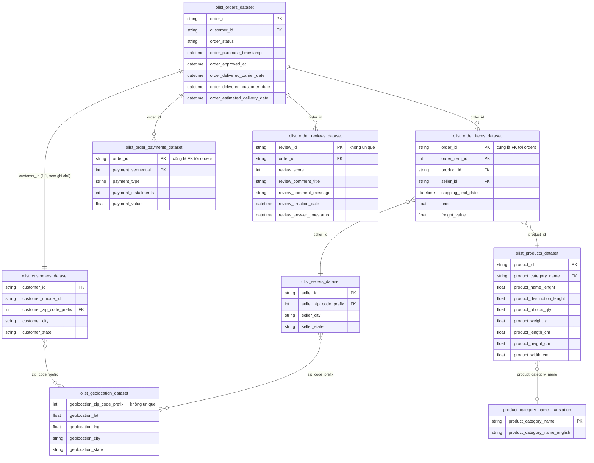

# Sơ đồ quan hệ (ERD) — bộ dữ liệu Olist

## Ghi chú quan trọng khi đọc sơ đồ

- **`orders` ↔ `customers` là quan hệ 1-1, không phải 1-nhiều.** Theo mô tả chính thức trên Kaggle: `customer_id` được sinh mới cho mỗi đơn hàng, kể cả cùng một người mua nhiều lần. Muốn nhận diện khách hàng thật (gộp các lần mua lại) phải dùng `customer_unique_id`, cột này **không phải khóa chính/khóa ngoại join với bảng nào khác** trong 9 bảng.
- **Join qua zip code (`*_zip_code_prefix` ↔ `geolocation_zip_code_prefix`) là nhiều-nhiều, không phải khóa ngoại chuẩn.** `olist_geolocation_dataset` không có cột định danh duy nhất — nhiều dòng lat/lng khác nhau có thể cùng một `geolocation_zip_code_prefix`. Join trực tiếp sẽ làm phình số dòng (fan-out), đã dedupe bằng `groupby("geolocation_zip_code_prefix")` lấy trung bình lat/lng, join vào `customer_zip_code_prefix` và `primary_seller_zip_code_prefix`, tính khoảng cách haversine ra đặc trưng `seller_customer_distance_km` (dùng trong model cuối, xem `models/final_model.json`).
- **`product_category_name` có thể null** ở `olist_products_dataset` (sản phẩm chưa phân loại) nên join với `product_category_name_translation` là optional (ký hiệu `o|` — zero hoặc một, không bắt buộc).
- **Khóa chính là khóa kép (composite)** ở 2 bảng: `olist_order_items_dataset` (`order_id` + `order_item_id`) và `olist_order_payments_dataset` (`order_id` + `payment_sequential`) — một `order_id` có nhiều dòng trong 2 bảng này.
- **`review_id` không phải khóa duy nhất trên thực tế**, dù về mặt thiết kế được coi là PK. Kiểm tra dữ liệu thô (Task #22) phát hiện 814 dòng trùng `review_id` (789 giá trị bị lặp, có giá trị lặp tới 3 lần), không do giá trị thiếu. Khi join `olist_order_reviews_dataset` vào `olist_orders_dataset` ở Sprint 2 cần cân nhắc dedupe hoặc chấp nhận fan-out có kiểm soát.

## Chi tiết khóa chính – khóa ngoại từng bảng

| Bảng | Khóa chính (PK) | Khóa ngoại (FK) | Trỏ tới |
|---|---|---|---|
| `olist_orders_dataset` | `order_id` | `customer_id` | `olist_customers_dataset.customer_id` |
| `olist_customers_dataset` | `customer_id` | `customer_zip_code_prefix` | `olist_geolocation_dataset.geolocation_zip_code_prefix` (không unique, xem ghi chú) |
| `olist_order_items_dataset` | `order_id` + `order_item_id` (composite) | `order_id`, `product_id`, `seller_id` | `olist_orders_dataset.order_id`, `olist_products_dataset.product_id`, `olist_sellers_dataset.seller_id` |
| `olist_order_payments_dataset` | `order_id` + `payment_sequential` (composite) | `order_id` | `olist_orders_dataset.order_id` |
| `olist_order_reviews_dataset` | `review_id` (không unique thật sự, xem ghi chú) | `order_id` | `olist_orders_dataset.order_id` |
| `olist_products_dataset` | `product_id` | `product_category_name` (có thể null) | `product_category_name_translation.product_category_name` |
| `olist_sellers_dataset` | `seller_id` | `seller_zip_code_prefix` | `olist_geolocation_dataset.geolocation_zip_code_prefix` (không unique, xem ghi chú) |
| `olist_geolocation_dataset` | không có (không có cột định danh duy nhất) | — | — |
| `product_category_name_translation` | `product_category_name` | — | — |
